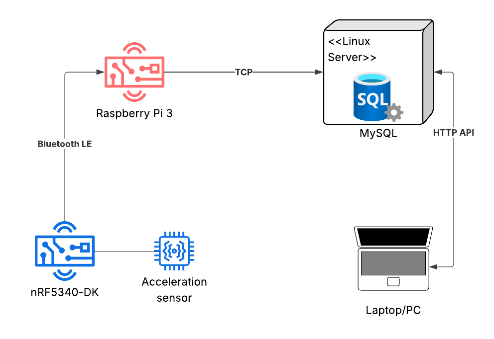
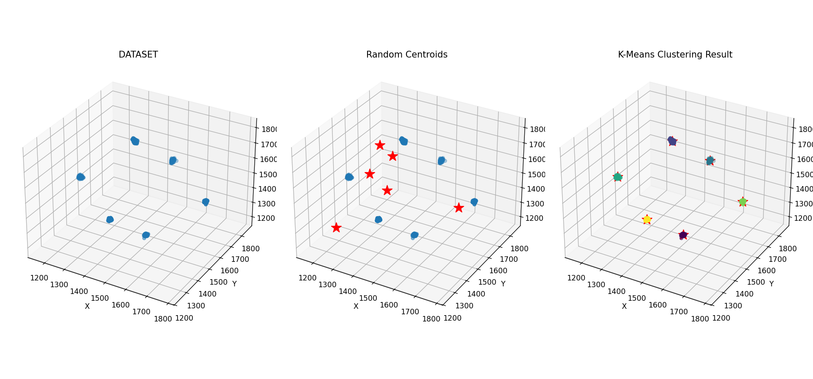
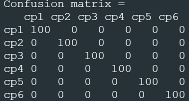

# README

## Tietoliikenteen sovellusprojekti 

---

**OAMK Tieto- ja viestintätekniikka – 2. vuoden syksy**

**Opiskelijat:**

**@harkonennen** – Harri Härkönen  
**@JoonasHeiskanen** – Joonas Heiskanen  

---

## Projektin kuvaus

Projektin keskipisteenä on datan mittaaminen, siirtäminen ja käsittely eri teknologioilla. Kiihtyvyyssensorilla mitataan nRF5340-alustalla, josta data siirretään BLE-yhteyttä  
hyödyntäen ensin Raspberry Pille ja siitä TCP-yhteydellä Linux-palvelimelle. Dataa haetaan MySQL-tietokannasta HTTP-rajapinnalla ja syötetään Python-algoritmille päättelemään sensorin orientaatio.

## Arkkitehtuurikuva

---

## Työkalut

Projekti on tehty hyödyntäen eri työkaluja, rautaa ja ympäristöjä. Alta löytyy lista työkaluista, joita projektissa on käytetty:

- **Editori:** Visual Studio Code  
- **Koodikielet:** Python, C  
- **Mikrokontrolleri:** Nordic Semiconductor nRF5340-DK  
- **Datansiirto:** Bluetooth Low Energy (BLE)  
- **Kiihtyvyysanturi:** GY-61 ADXL335 3-Axis Accelerometer Module  
- **Kehitysalusta:** Raspberry Pi  
- **Tietokanta:** MySQL  
- **Palvelin:** Ubuntu Linux  
- **Versionhallinta:** GitHub, GitBash  

---

## Datan mittaaminen

Kiihtyvyyssensorista mitataan dataa NRF5340 alustalla. 3-akselinen kiihtyvyysensori mittaa dataa X, Y, Z-akseleilta. Mittaaminen tapahtuu painamalla nappia, jolloin haluttu määrä näytteitä otetaan talteen ja lähetetään. Oletuksena näytteenottotaajuus on 100 näytettä sekunnissa.

---

## Datan käsittely

NRF5340 lähettää Bluetooth Low Energy -yhteyden yli datapaketteja Raspberry 3:lle.. Raspberryllä pyörivä python-koodi pakkaa datan ja lähettää sen TCP-rajapinnan yli Linux-palvelimelle MySQL-tietokantaan, johon data tallennetaan.

---

## Datan käyttö

Data haetaan HTTP-yhteyden yli MySQL-tietokannasta ja tallennetaan tietokoneella CSV-tiedostoon. Python-koodi lukee tämän CSV-tiedoston ja vie tämän datan K-means algoritmin läpi.

## K-means

*K-means 3D datapistekuvat eri vaiheista.*
*Siniset pallot kuvastavat datapisteitä ja punaiset tähdet sentroideja.*

### <small>Dataset</small>
Tässä kuvassa näkyvät kiihtyvyysanturista mitatut alkuperäiset datapisteet kolmiulotteisessa avaruudessa.  
Jokainen sininen piste vastaa yksittäistä mittausta X-, Y- ja Z-akseleilta. Yhdessä datapiste setissä on 100 mitattua näytettä.

### <small>Random Centroids</small>
Arvotaan satunnaiset keskipisteet toisessa kuvassa.

<small>**Clustering Result**</small>
Viimeisessä kuvassa python-koodi on toteutettu siten, että lähimmäisenä datapisteitä olevat sentroidit voittavat lähimmäiset datapisteet itselleen ja siirtyy kyseisten datapisteiden keskelle. Tuloksena saadaan tieto, mihin päin sensori osoittaa tai mikä on sen suunta.

<small><b>TÄRKEÄ VÄLIOTSIKKO PIENEMMÄLLÄ FONTTILLA</b></small>

 

---

K-means-algoritmin laskemat kuusi keskipistettä siirretään nRF5340-laitteelle. Laitteen kiihtyvyysanturilla mitataan 100 näytettä kuuteen eri suuntaan, ja jokainen mittaus luokitellaan valitsemalla lähin keskipiste euklidisen etäisyyden perusteella. Luokittelun tuloksista lasketaan confusion matrix, joka kuvaa luokittelijan tarkkuutta.  

## Confusion matrix
  
*Esimerkkituloksena saatu confusion matrix, jossa K-means-luokittelija tunnistaa kaikki suunnat oikein*.
